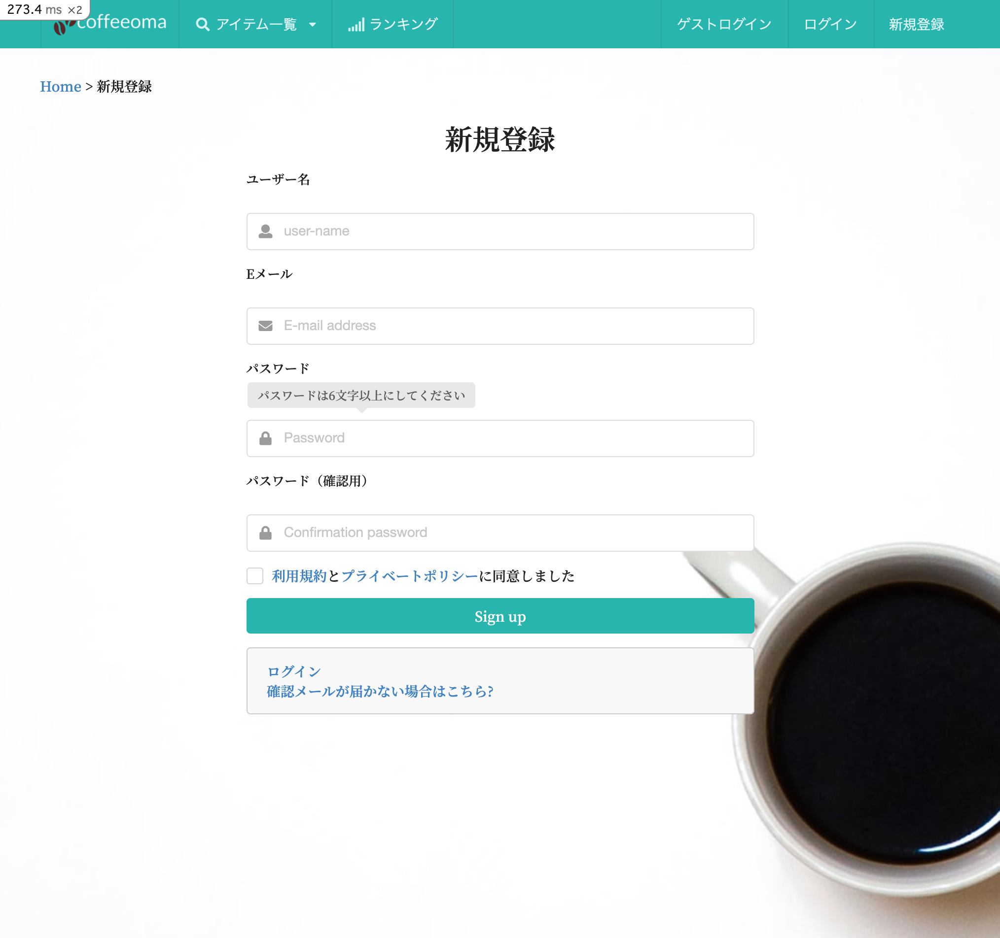

<!--
title: 【Rspec】Rails system_specでのcheckboxのテストの仕方
tags: Rails,Rspec,system_spec,checkbox
-->

# はじめに

ポートフォリオの作成時にログインページで、利用規約のチェックボックスを作成しました。
そのチェックボックスをシステムテストで少し躓いたので、忘備録として残しておくことにします。

## 環境

- Ruby 2.7.4
- Rails 6.1.3
- semantic-ui-sass 2.4.2.0
- Rspec 5.0.1

# views

CSS ライブラリとして semantic-ui を使用し、モジュールの checkbox を利用しています。
checkbox のラベルをクリックすることでチェックが入るようになっています。
チェックが入っていない場合は、エラーメッセージが出て先に進めないようにしてます。

## UI



## 　 ソースコード

```slim:app/views/devis/registrations/new.html.slim
.ui.container
  .ui.grid
    .column
      - breadcrumb :sign_in
      = breadcrumbs separator: " > " ,class: 'ui breadcrumb top-padding', fragment_class: 'section', current_class: 'active'
  .ui.middle.aligned.center.aligned.grid
    .column style= "width: 543px"
      h1#title 新規登録
      = form_with model: @user, url: user_registration_path,id: "new_user", class: "new_user ui form text-left", local: true do |f|
        .field
          = f.label :username
          br
          .ui.left.icon.input
            i.user.icon
            = f.text_field :username, autofocus: true, autocomplete: "name", placeholder: "user-name",id: 'username'
        .field
          = f.label :email
          br
          .ui.left.icon.input
            i.mail.icon
            = f.email_field :email, autofocus: true, autocomplete: "email",placeholder: "E-mail address",id: 'email'
        .field
          = f.label :password
          - if @minimum_password_length
            .ui.pointing.below.label
              font style= "vertical-align: inherit;"
                | パスワードは
                = @minimum_password_length
                | 文字以上にしてください
          br
          .ui.left.icon.input
            i.lock.icon
            = f.password_field :password, autocomplete: "new-password",placeholder: "Password", id:'password'
        .field
          = f.label :password_confirmation
          br
          .ui.left.icon.input
            i.lock.icon
            = f.password_field :password_confirmation, autocomplete: "new-password",placeholder: "Confirmation password", id: 'password_confirmation'
        .inline.field
          .ui.checkbox.mb-1rem
            = label_tag :policy
              = link_to '利用規約',policy_path
              と
              = link_to 'プライベートポリシー', private_policy_path
              | に同意しました
            = check_box_tag :policy
        .field
          =f.button type: "submit",class: "ui teal fluid animated fade button", data: { disable_with: "送信中" }  do
            .visible.content
              |Sign up
            .hidden.content
              |登録
        .ui.error.message
      .ui.message.text-left
        .container= render "devise/shared/links"
      .segment

```

# system spec

このページのテストを書く際に、チェックボックスを押す必要があるのですがラベルの一部がリンクになっているのでラベルをクリックさせるとテストがうまくいきません。
ですので、リンクでない文字にクラスを付与しそれをクリックさせます。

## views の変更

```slim:app/views/devis/registrations/new.html.slim
#省略

.inline.field
  .ui.checkbox.mb-1rem
    = label_tag :policy
      = link_to '利用規約',policy_path
      span.spec-policy と #ここにクラスを付与する
      = link_to 'プライベートポリシー', private_policy_path
      | に同意しました
    = check_box_tag :policy

```

##

find でクラスを指定してクリックをします。
このようにする事で、リンクを作動させずにチェックを入れることができます。

```ruby:spec/system/registrations_spec.rb
require 'rails_helper'

RSpec.describe 'Registrations', type: :system, js: true do #javascriptが動く環境でないとテストがうまくいきません
  describe 'sign_up' do
    it "displayed message" do
      visit new_user_registration_path
      fill_in 'user-name', with: 'test1'
      fill_in 'E-mail address', with: 'test@example.com'
      fill_in 'Password', with: 'password'
      fill_in 'Confirmation password', with: 'password'
      find('.spec-policy').click
      click_button 'Sign up'
      expect(page).to have_content '本人確認用のメールを送信しました。メール内のリンクからアカウントを有効化させてください。'
    end
  end
end


```

# 参考

[使える RSpec 入門・その 4「どんなブラウザ操作も自由自在！逆引き Capybara 大辞典」](https://qiita.com/jnchito/items/607f956263c38a5fec24)
